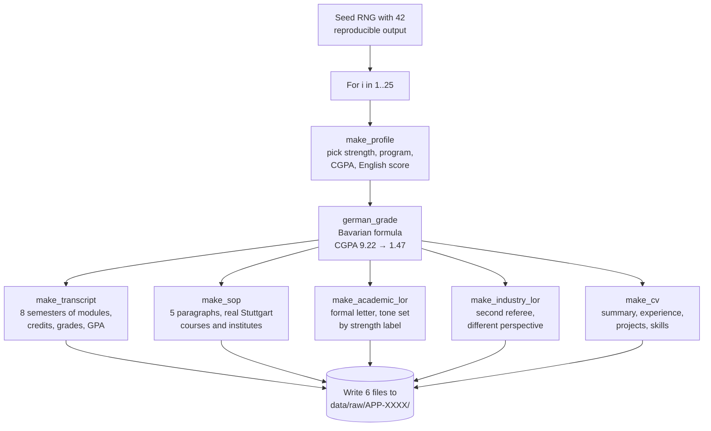
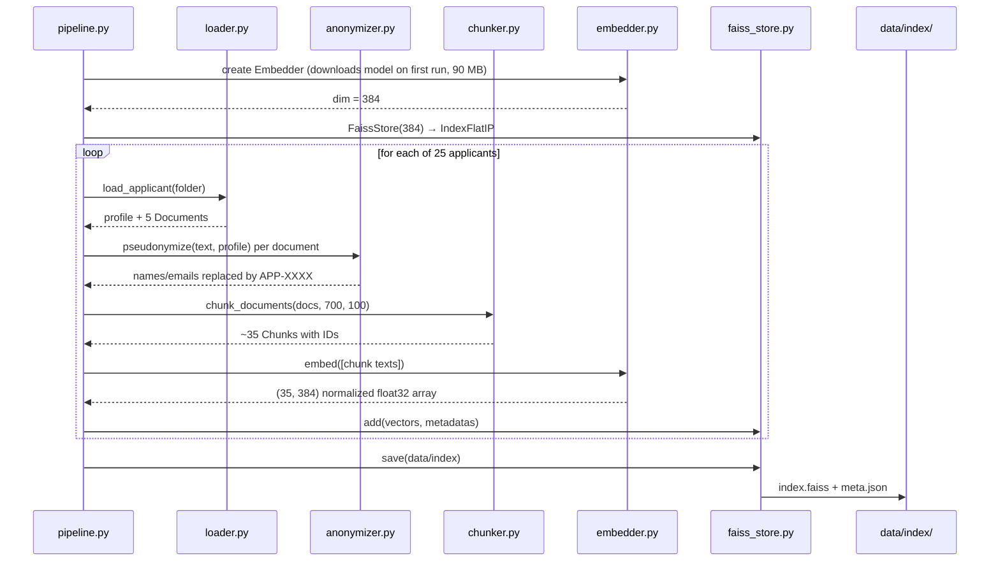
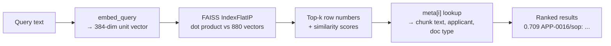
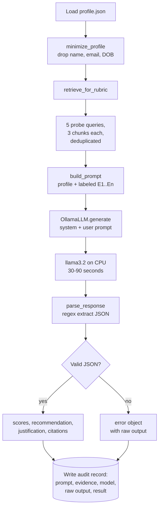
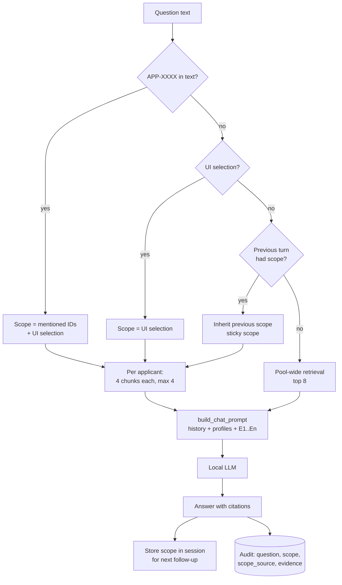
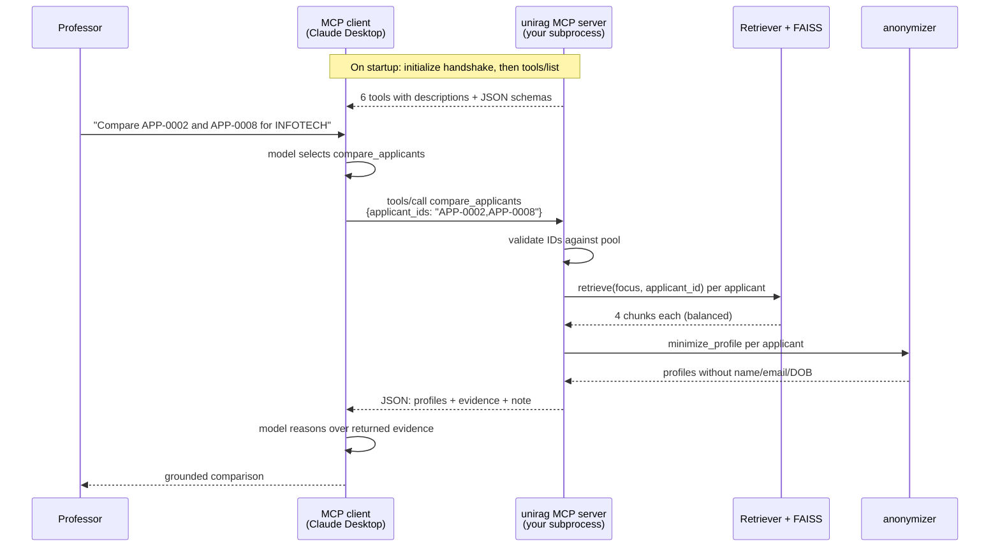
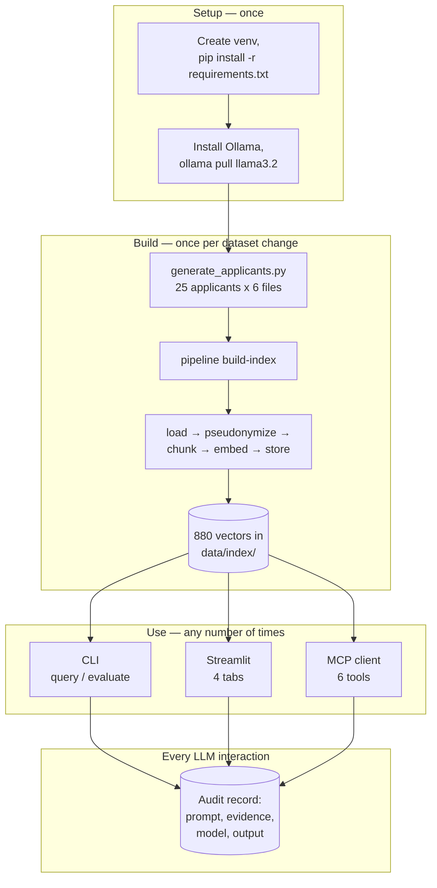

# UniRAG — Concepts, Implementation and Execution Flow

A deep explanation of every technology in this project: what it is, how it works, and exactly where and how it is used in the code. Followed by a complete walkthrough of what happens, step by step, when you run the project.

Diagrams are Mermaid and render on GitHub. In VS Code, install "Markdown Preview Mermaid Support" and press `Ctrl+Shift+V`.

---

## Contents

**Part A — The technologies**
1. [Embeddings and SentenceTransformers](#1-embeddings-and-sentencetransformers)
2. [FAISS and vector databases](#2-faiss-and-vector-databases)
3. [Chunking](#3-chunking)
4. [Ingestion](#4-ingestion)
5. [Semantic retrieval](#5-semantic-retrieval)
6. [LangChain](#6-langchain)
7. [Local LLMs and quantized SLMs](#7-local-llms-and-quantized-slms)
8. [Prompt orchestration](#8-prompt-orchestration)
9. [MCP — Model Context Protocol](#9-mcp--model-context-protocol)

**Part B — The flows**
10. [Flow 1 — Generating the data](#10-flow-1--generating-the-data)
11. [Flow 2 — Building the index](#11-flow-2--building-the-index)
12. [Flow 3 — A semantic query](#12-flow-3--a-semantic-query)
13. [Flow 4 — A rubric evaluation](#13-flow-4--a-rubric-evaluation)
14. [Flow 5 — A chat turn in the UI](#14-flow-5--a-chat-turn-in-the-ui)
15. [Flow 6 — An MCP tool call](#15-flow-6--an-mcp-tool-call)
16. [The complete lifecycle](#16-the-complete-lifecycle)

---

# Part A — The technologies

## 1. Embeddings and SentenceTransformers

### The idea

A computer cannot compare meanings directly. An **embedding** solves this by turning a piece of text into a list of numbers — a vector — positioned in a high-dimensional space so that texts with similar meaning end up near each other.

Think of a library where books are shelved not alphabetically but by topic: cookbooks cluster in one corner, physics in another, and a book about the chemistry of baking sits between them. Embeddings do this automatically, in 384 dimensions instead of 2, for arbitrary text.

The practical consequence: the query "strong research background" can find a sentence saying "their thesis demonstrated rigorous experimental methodology" even though the two share no words at all. That is **semantic** search, and it is the reason RAG works better than keyword matching for documents written in natural language.

### How it actually works

The model is a transformer neural network. Text is tokenized into word pieces, each token is processed through six transformer layers that let every token attend to every other token (so "bank" in "river bank" gets a different representation than in "bank account"), and the resulting per-token vectors are averaged into one 384-number vector for the whole passage. The model was trained on over a billion sentence pairs with a contrastive objective: pull semantically related pairs together in vector space, push unrelated pairs apart. That training is what makes geometric distance correspond to meaning.

**Similarity measurement.** Two vectors are compared by cosine similarity — the cosine of the angle between them, ranging from −1 (opposite) to 1 (identical direction). The formula is the dot product divided by the product of the magnitudes:

```
cos(A,B) = (A · B) / (|A| × |B|)
```

If every vector is first scaled to length 1 (normalized), the denominator becomes 1, so **cosine similarity is simply the dot product**. This is a small trick with a big payoff, as the next section shows.

### In this project

**File:** `src/embeddings/embedder.py`

```python
class Embedder:
    def __init__(self, model_name="sentence-transformers/all-MiniLM-L6-v2", batch_size=32):
        from sentence_transformers import SentenceTransformer
        self.model = SentenceTransformer(model_name)
        self.batch_size = batch_size
        self.dim = self.model.get_sentence_embedding_dimension()   # 384

    def embed(self, texts: list[str]) -> np.ndarray:
        vecs = self.model.encode(texts, batch_size=self.batch_size,
                                 normalize_embeddings=True,      # <- the key line
                                 show_progress_bar=False)
        return np.asarray(vecs, dtype="float32")

    def embed_query(self, text: str) -> np.ndarray:
        return self.embed([text])[0]
```

`normalize_embeddings=True` is what lets FAISS use fast inner-product search while the scores stay interpretable as cosine similarity. `float32` is required because FAISS refuses anything else.

The model, `all-MiniLM-L6-v2`, is a deliberate choice: 6 layers instead of 12, ~90 MB, distilled for speed, fast on CPU, and it runs fully offline after the first download — which is what makes the local-only privacy guarantee possible. In your run, embedding all 880 chunks took a few seconds.

The class is used at two different moments: `embed()` on batches during index building (`pipeline.py`), and `embed_query()` on a single question at query time (`retriever.py`). Swapping to a stronger model such as `all-mpnet-base-v2` (768-dim, better quality, slower) means changing one line in `config.yaml` and rebuilding the index.

---

## 2. FAISS and vector databases

### The idea

Once you have 880 vectors, a question becomes: which of them are closest to my query vector? The naive answer is to compare against all 880 — fine here, hopeless at ten million. **FAISS** (Facebook AI Similarity Search) is a C++ library with Python bindings that makes this search fast, with several index types trading accuracy for speed.

An analogy: finding the nearest restaurant. Brute force checks the distance to every restaurant in the city. An approximate index first narrows to your neighbourhood, then checks only those — much faster, with a small chance of missing a marginally closer one just over the boundary.

### Index types

| Index | How it works | When to use |
|---|---|---|
| `IndexFlatIP` / `IndexFlatL2` | Exact brute-force over every vector | Up to ~100k vectors — this project |
| `IndexIVFFlat` | Partitions space into cells, searches only nearby cells | 100k–10M vectors |
| `IndexHNSW` | Navigable small-world graph, hops toward the query | Large scale, high recall |
| `IndexIVFPQ` | Adds product quantization to compress vectors | Memory-constrained, billions |

This project uses `IndexFlatIP`: *Flat* = exact, no approximation; *IP* = inner product. Because vectors are normalized, inner product equals cosine similarity — so an exact, interpretable, zero-tuning index.

### FAISS is not a database

This distinction matters for your CV wording. FAISS stores **only vectors** and returns **only row numbers**. It has no notion of documents, no metadata, no filtering, no persistence layer, no network API. A real vector database (Qdrant, Weaviate, Milvus, Chroma) adds those on top.

This project therefore implements the missing pieces itself: a **metadata sidecar** — a Python list, position-aligned with FAISS rows — mapping each row back to its chunk ID, applicant ID, document type and text.

### In this project

**File:** `src/vectorstore/faiss_store.py`

```python
class FaissStore:
    def __init__(self, dim: int):
        import faiss
        self.index = faiss.IndexFlatIP(dim)   # 384 dims, inner product
        self.meta: list[dict] = []            # row i in index == meta[i]

    def add(self, vectors, metadatas):
        assert len(vectors) == len(metadatas)   # alignment is the whole contract
        self.index.add(vectors)
        self.meta.extend(metadatas)

    def search(self, query_vec, top_k=6, applicant_id=None):
        k = top_k * 10 if applicant_id else top_k        # over-fetch, then filter
        k = min(k, self.index.ntotal)
        scores, idxs = self.index.search(query_vec.reshape(1, -1), k)
        results = []
        for score, i in zip(scores[0], idxs[0]):
            if i < 0:
                continue
            m = self.meta[i]
            if applicant_id and m["applicant_id"] != applicant_id:
                continue
            results.append({**m, "score": float(score)})
            if len(results) >= top_k:
                break
        return results
```

Two design details worth understanding. **The alignment contract**: `meta[i]` must describe the vector at FAISS row `i`. The `assert` in `add()` enforces it — break that alignment and the system silently returns the wrong text for every hit, which is exactly the kind of bug that is hard to spot and easy to prevent.

**Over-fetch and post-filter**: FAISS cannot filter by applicant, so scoped search asks for `top_k × 10` global results and discards the ones belonging to other applicants. Simple and correct at this scale; a production vector database would push the filter down into the index. This is the exact seam where a Qdrant migration would happen — the class interface stays identical, so nothing else in the codebase changes.

Persistence is two files written by `save()`: `data/index/index.faiss` (the binary vectors) and `data/index/meta.json` (the sidecar). `load()` restores both, which is why the CLI and the UI can share one prebuilt index.

---

## 3. Chunking

### Why cut documents up

Three reasons, all practical. First, **model limits**: the embedding model truncates input around 256 word pieces, so a 500-word letter would be silently cut off — most of it never represented. Second, **precision**: one vector for a whole letter averages together praise, criticism and boilerplate into a vague blur; the professor asking about weaknesses should get the paragraph about weaknesses. Third, **context budget**: the LLM prompt has limited room, so you want to spend it on relevant paragraphs, not whole documents.

The trade-off is a genuine tension. Chunks too small lose context ("they improved noticeably" — who? at what?). Chunks too large dilute the vector and waste prompt space. 700 characters with 100 characters of overlap sits in the sweet spot for letter-style prose.

### Recursive splitting

A naive splitter cuts every 700 characters regardless of content, which slices sentences in half. **Recursive character splitting** instead tries separators in priority order: paragraph break, then line break, then sentence end, then space, then hard cut. It only falls to the next separator when a piece is still too long. That is why your retrieved evidence reads as coherent paragraphs rather than fragments.

**Overlap** means consecutive chunks share their boundary region. If a key sentence straddles a cut point, the overlap guarantees it appears intact in at least one chunk. The cost is mild duplication in the index.

### In this project

**File:** `src/ingestion/chunker.py`

```python
try:
    from langchain_text_splitters import RecursiveCharacterTextSplitter
    _HAS_LC = True
except ImportError:
    _HAS_LC = False

def chunk_documents(docs, chunk_size=700, chunk_overlap=100):
    if _HAS_LC:
        splitter = RecursiveCharacterTextSplitter(
            chunk_size=chunk_size, chunk_overlap=chunk_overlap,
            separators=["\n\n", "\n", ". ", " "])     # priority order
        split = splitter.split_text
    else:
        split = lambda t: _fallback_split(t, chunk_size, chunk_overlap)

    chunks = []
    for doc in docs:
        for j, piece in enumerate(split(doc.text)):
            chunks.append(Chunk(
                chunk_id=f"{doc.applicant_id}:{doc.doc_type}:{j}",   # APP-0007:lor_1:2
                applicant_id=doc.applicant_id,
                doc_type=doc.doc_type,
                text=piece.strip(),
                metadata=doc.metadata))
    return chunks
```

The `chunk_id` format `applicant:document:position` gives every chunk a globally unique, human-readable identity that survives into the vector store, the prompts, and the audit trail — so any piece of evidence can be traced back to its exact origin.

Measured effect in your project: v1 short documents produced ~9 chunks per applicant; v2 long-form documents produce 33–37, for 880 vectors across 25 applicants.

---

## 4. Ingestion

### The idea

Ingestion is the boundary layer between "whatever format the documents happen to be in" and "the uniform objects the rest of the pipeline understands". Getting this boundary right is why adding PDF support later will touch exactly one file.

### In this project

**File:** `src/ingestion/loader.py`

```python
@dataclass
class Document:
    applicant_id: str          # "APP-0007"
    doc_type: str              # sop | lor_1 | lor_2 | cv | transcript
    text: str
    metadata: dict = field(default_factory=dict)

def load_applicant(app_dir: Path) -> tuple[dict, list[Document]]:
    profile = json.loads((app_dir / "profile.json").read_text())
    docs = []
    for key, label in DOC_TYPES.items():
        f = app_dir / f"{key}.txt"
        if f.exists():
            docs.append(Document(
                applicant_id=profile["applicant_id"],
                doc_type=key,
                text=f.read_text(),
                metadata={"doc_label": label, "program": profile["program"]}))
    return profile, docs
```

The critical piece is that `doc_type` is attached here and never lost: it flows into chunks, into vector metadata, into retrieval results, into prompts, and into the UI, which is how the interface can tell the professor "this evidence came from the academic recommendation letter". **Provenance is established at ingestion and preserved end to end.**

---

## 5. Semantic retrieval

### The idea

Retrieval is the query-time half of RAG: embed the question with the same model used for the documents (this is essential — vectors from different models are not comparable), search the index, return the closest chunks.

### Two retrieval patterns in this project

**File:** `src/retrieval/retriever.py`

**Pattern 1 — free-form retrieval.** One query in, ranked chunks out. Used by the semantic-search tab, the chat engine, and the MCP search tool.

```python
def retrieve(self, query: str, applicant_id: str | None = None) -> list[dict]:
    qv = self.embedder.embed_query(query)
    return self.store.search(qv, top_k=self.top_k, applicant_id=applicant_id)
```

**Pattern 2 — rubric-aligned retrieval.** This is the project's most distinctive design decision. Rather than one generic query per applicant, each evaluation criterion gets its own probe query:

```python
CRITERION_QUERIES = {
    "academic_readiness": "academic performance, grades, GPA, coursework, transcript strength",
    "research_potential": "research experience, thesis, publications, methodology, projects",
    "motivation_fit":     "motivation, goals, why this program, alignment with program strengths",
    "recommendations":    "recommender assessment, strengths, weaknesses, ranking among students",
    "experience_skills":  "work experience, technical skills, software projects, internships",
}

def retrieve_for_rubric(self, applicant_id, per_criterion=3):
    evidence, seen = {}, set()
    for crit, q in CRITERION_QUERIES.items():
        qv = self.embedder.embed_query(q)
        hits = self.store.search(qv, top_k=per_criterion, applicant_id=applicant_id)
        fresh = [h for h in hits if h["chunk_id"] not in seen]   # deduplicate
        seen.update(h["chunk_id"] for h in fresh)
        evidence[crit] = fresh
    return evidence
```

Why this matters: a single generic query like "evaluate this applicant" would return mostly SOP text, because SOPs are self-descriptive and self-promotional by nature — the transcript would rarely surface. Running one probe per criterion **guarantees coverage** of all five dimensions, and it makes each score explainable because each criterion carries its own evidence. Deduplication prevents the same paragraph appearing five times and wasting the context budget.

### The known weakness

Dense-only retrieval has a blind spot visible in your own testing: letter *headers* scored highly for INFOTECH queries, because a header repeating "MSc Information Technology (INFOTECH), University of Stuttgart" is semantically dense but informationally empty. Dense retrieval also handles exact terms poorly — a module code like `EE5321` or a niche tool name has no meaningful semantic neighbourhood.

The fix is **hybrid retrieval**: run BM25 (a classical lexical scoring function that rewards rare exact term matches) alongside dense search, then fuse the two rankings with Reciprocal Rank Fusion, where each document scores `Σ 1/(k + rank_in_that_list)`. Lexical search nails exact terms, dense search nails paraphrase, and fusion needs no score calibration between them. This is roadmap item 1.

---

## 6. LangChain

### What it is

LangChain is a framework for LLM applications, offering document loaders, text splitters, vector store wrappers, prompt templates, chains (LCEL), memory, agents, and tool abstractions. Its value is speed of assembly and swappable components; its cost is a heavy dependency, abstraction layers that obscure what is actually happening, and frequent breaking API changes.

### Honest scope in this project

**This project uses exactly one component of LangChain: `RecursiveCharacterTextSplitter` in `src/ingestion/chunker.py`** — and even that has a pure-Python fallback so the module works without LangChain installed.

Everything else is deliberately hand-written: the retriever, the vector store wrapper, prompt construction, the chat loop, and the evaluation orchestration. This was a defensible choice — writing the FAISS integration by hand is roughly forty lines and it forced an understanding of normalization, metadata alignment and filtered search that a `LangChain.FAISS.from_documents(...)` one-liner would have hidden. For a thesis, that understanding is the point.

But be precise about it in interviews. If asked "how did you use LangChain?", the accurate answer is: "For recursive text splitting. I implemented retrieval, prompting and orchestration directly against FAISS and the Ollama API so I could control and instrument each step — which mattered because my audit trail needs the exact prompt and evidence for every call."

That answer is stronger than an inflated claim, and it is true.

---

## 7. Local LLMs and quantized SLMs

### Model size and quantization

A language model's size is measured in parameters — the learned numbers inside it. GPT-4-class models have hundreds of billions; a **Small Language Model (SLM)** has roughly 1–8 billion, small enough to run on a laptop.

Parameters are normally stored as 16-bit floats. **Quantization** compresses them to fewer bits — typically 4 — by storing, for each small block of weights, a scale factor plus low-precision integers. A 3-billion-parameter model at 16 bits needs about 6 GB; at 4 bits it needs about 2 GB, which is exactly the size of the `llama3.2` file you downloaded.

Quantization delivers three wins and one cost. Wins: it fits in RAM, it runs faster because memory bandwidth is the bottleneck in inference, and it makes CPU-only operation practical. Cost: a small accuracy loss, generally modest at 4 bits but real — and compounded by the model being small in the first place.

You have observed those limits directly: llama3.2 blended one applicant's capstone title into another applicant's summary, and its comparison reasoning was somewhat shallow. That is not a bug in your pipeline; it is the honest capability ceiling of a 3B quantized model, and documenting it is a legitimate research finding.

### Ollama

Ollama is a local server that downloads, quantizes, stores and serves open models behind a simple HTTP API on `localhost:11434`. It handles model loading, memory management and the chat template each model expects. `ollama pull llama3.2` fetches and prepares the model; your Python client then just sends messages.

The privacy consequence is the entire point of this architecture: applicant text goes from your disk to a process on your own machine and back. No network request, no third-party processor, no cross-border transfer — the GDPR analysis becomes trivial because there is no transfer to analyse.

### In this project

**File:** `src/llm/local_llm.py`

```python
class OllamaLLM:
    def __init__(self, model="llama3.2", temperature=0.1, max_tokens=900):
        import ollama
        self.client = ollama.Client()
        self.model = model
        self.options = {"temperature": temperature, "num_predict": max_tokens}

    def generate(self, system: str, prompt: str) -> str:
        resp = self.client.chat(
            model=self.model,
            messages=[{"role": "system", "content": system},
                      {"role": "user", "content": prompt}],
            options=self.options)
        return resp["message"]["content"]


class MockLLM:
    model = "mock"
    def generate(self, system, prompt):
        return '{"scores": {...}, "recommendation": "borderline", ...}'


def get_llm(cfg: dict):
    if cfg.get("provider") == "mock":
        return MockLLM()
    try:
        return OllamaLLM(cfg.get("model", "llama3.2"), cfg.get("temperature", 0.1),
                         cfg.get("max_tokens", 900))
    except Exception as e:
        print(f"[warn] Ollama unavailable ({e}); falling back to MockLLM")
        return MockLLM()
```

Three deliberate choices. **`temperature=0.1`** — temperature controls sampling randomness; evaluation demands reproducibility, so near-deterministic output is correct here, where a creative writing task would want 0.7+. **The one-method interface** `generate(system, prompt)` means every other module is model-agnostic. **MockLLM plus graceful fallback** is why the entire pipeline, UI and test suite ran end to end before Ollama was ever installed — the system degrades to a working state instead of crashing.

Upgrading is a config edit: `ollama pull qwen2.5:7b`, then set `llm.model: qwen2.5:7b`. A 7B model would likely reduce the cross-contamination you observed.

---

## 8. Prompt orchestration

### The idea

Prompt orchestration is everything between "we have relevant chunks" and "we have a usable, verifiable answer": assembling the prompt, constraining the output format, parsing the response, and logging the whole exchange.

### The four techniques used here

**System prompt as governance.** The system prompt carries standing rules separate from the content: use only the supplied evidence, cite evidence IDs, admit missing evidence, output only JSON, and never make a final decision. This is where the EU AI Act human-oversight requirement is technically enforced.

**Evidence labeling.** Every chunk is tagged `[E1]…[En]` with its source. This single trick converts "the model said something plausible" into "the model said X citing E3, and a human can open E3 and verify". Citations are the mechanism that makes grounding checkable rather than merely hoped-for.

**Structured output.** Forcing JSON makes the result machine-processable — score charts, batch statistics, and calibration against the hidden strength labels all become straightforward. Because small models occasionally wrap JSON in prose or markdown fences, parsing is defensive.

**Audit logging.** Every call writes prompt, evidence, model ID and raw output to disk.

### In this project

**File:** `src/orchestration/evaluator.py`

```python
SYSTEM_PROMPT = """You are an admissions evaluation assistant... you never make the final decision.

Rules:
1. Base every claim ONLY on the provided evidence chunks [E1..En] and the structured profile.
2. Cite evidence IDs for each criterion.
3. If evidence is missing for a criterion, say so and score conservatively.
4. Score each criterion 1-5 (1=weak, 3=adequate, 5=exceptional).
5. Respond with ONLY valid JSON, no markdown fences, matching:
{"scores": {<criterion>: int, ...},
 "recommendation": "admit" | "borderline" | "reject",
 "justification": "<3-5 sentences>",
 "evidence_cited": ["E1", ...]}"""


def build_prompt(profile_min, evidence):
    flat, lines, eid = [], [], 0
    for crit, hits in evidence.items():
        for h in hits:
            eid += 1
            h = {**h, "eid": f"E{eid}"}
            flat.append(h)
            lines.append(f"[E{eid}] ({h['doc_type']}, criterion hint: {crit})\n{h['text']}")
    prompt = (f"Structured profile (pseudonymized):\n{json.dumps(profile_min, indent=2)}\n\n"
              f"Evidence chunks:\n\n" + "\n\n".join(lines) +
              f"\n\nEvaluate the applicant on: {', '.join(RUBRIC)}. Return JSON only.")
    return prompt, flat


def parse_response(raw: str) -> dict:
    m = re.search(r"\{.*\}", raw, re.DOTALL)      # tolerate prose/fences around JSON
    if not m:
        return {"error": "unparseable", "raw": raw}
    try:
        return json.loads(m.group(0))
    except json.JSONDecodeError:
        return {"error": "invalid_json", "raw": raw}
```

The chat variant, `src/orchestration/chat.py`, adds conversational concerns: scope resolution (which applicants is this question about), sticky scope inheritance for follow-ups, per-applicant retrieval caps so comparisons stay balanced, and an anti-contamination rule instructing the model that conversation history exists only to interpret the question, never to supply facts. Each of those three mechanisms was written in response to an observed failure — which is the documented empirical contribution of this project.

---

## 9. MCP — Model Context Protocol

### In layman's terms

Think of USB-C. Before it, every device had its own connector and every pairing needed its own cable. USB-C is one standard: any device, any host, one plug.

MCP is USB-C for AI tools. Before it, connecting an AI assistant to a system meant custom integration code for each assistant. MCP defines one standard way for a program to say "here are the tools I offer, here is what each does, here are the arguments it takes" — and any MCP-capable assistant can then discover and use them.

For your project, concretely: today, using UniRAG means opening your Streamlit app. With MCP, a professor can be working inside Claude Desktop and simply ask *"compare APP-0002 and APP-0008 for INFOTECH"*. Claude discovers your `compare_applicants` tool, calls it, receives pseudonymized evidence, and reasons over it — with a far more capable model than your local 3B, while **the applicant documents and the FAISS index never leave your machine**. Only the specific pseudonymized snippets your tools choose to return cross the boundary.

That last point is the architecturally interesting one: MCP lets you separate *where the data lives* from *which model does the reasoning*, and your tool layer is the policy gate deciding exactly what is allowed out.

### Technical explanation

MCP is a JSON-RPC 2.0 protocol between a **client** (the AI application) and a **server** (your program). Transport is usually **stdio** — the client launches your server as a subprocess and speaks over stdin/stdout — or HTTP for remote servers. Servers can expose three kinds of capability: **tools** (functions the model may call), **resources** (readable data the client can load into context), and **prompts** (reusable templates). This project exposes tools.

The lifecycle: on startup the client and server exchange an `initialize` handshake declaring protocol version and capabilities. The client then calls `tools/list`, and the server returns each tool's name, human-readable description, and a JSON Schema for its arguments. The model reads those descriptions to decide what to call. When it decides, the client sends `tools/call` with the tool name and arguments; the server executes and returns content. Crucially, **the tool description is prompt engineering** — it is the only thing the model sees when deciding whether a tool fits, so descriptions must state clearly what the tool does, what it returns, and any caveats.

The Python SDK removes nearly all the boilerplate: a decorator inspects your function's type hints and docstring to generate the JSON Schema automatically.

### In this project

**File:** `src/mcp_server/server.py`

```python
try:
    from mcp.server.mcpserver import MCPServer as _Server   # mcp >= 2.0
except ImportError:
    from mcp.server.fastmcp import FastMCP as _Server       # mcp < 2.0

mcp = _Server(
    name="unirag",
    instructions=("Tools for exploring a pool of pseudonymized university "
                  "applications... All evaluations are advisory: a human reviewer "
                  "makes the final admission decision."),
)

_retriever = None            # lazy: server starts instantly, model loads on first use

def get_retriever():
    global _retriever
    if _retriever is None:
        from src.embeddings.embedder import Embedder
        from src.vectorstore.faiss_store import FaissStore
        from src.retrieval.retriever import Retriever
        e = CFG["embeddings"]
        _retriever = Retriever(FaissStore.load(CFG["data"]["index_dir"]),
                               Embedder(e["model_name"], e["batch_size"]),
                               top_k=CFG["retrieval"]["top_k"])
    return _retriever


@mcp.tool(description="Semantic search over applicant documents (SOPs, "
                      "recommendation letters, CVs, transcripts). Returns the most "
                      "relevant text chunks with similarity scores and their source "
                      "document. Set applicant_id to search within one applicant, or "
                      "leave it empty to search the whole pool.")
def search_applications(query: str, applicant_id: str = "", top_k: int = 6) -> str:
    hits = get_retriever().retrieve(query, applicant_id=applicant_id or None)[:top_k]
    return json.dumps({"query": query, "results": [...]}, indent=2)


@mcp.tool(description="Get the pseudonymized structured profile of one applicant... "
                      "Personal identifiers are never returned.")
def get_applicant_profile(applicant_id: str) -> str:
    from src.privacy.anonymizer import minimize_profile
    return json.dumps(minimize_profile(_load_profile(applicant_id)), indent=2)
```

**The six exposed tools:**

| Tool | Purpose | LLM needed |
|---|---|---|
| `list_applicants` | Discover the pool: IDs, programs, grades | No |
| `get_applicant_profile` | Minimized structured profile for one applicant | No |
| `search_applications` | Semantic search, pool-wide or scoped | No |
| `get_evidence_for_criteria` | Rubric-aligned evidence for all five criteria | No |
| `compare_applicants` | Balanced per-applicant evidence for 2–4 candidates | No |
| `evaluate_applicant` | Full local-LLM rubric evaluation + audit record | Yes |

Note the split: five tools return *evidence* for the client's model to reason over, and one runs the *local* model. That is a genuine architectural choice worth defending in a thesis — the remote model can be the reasoner while local infrastructure remains the retriever and the privacy gate, or the entire evaluation can stay local if policy demands it.

**Privacy at the boundary.** Every tool returns pseudonymized text and minimized profiles; `tests/test_mcp_server.py` includes a regression test asserting that `name`, `email` and `date_of_birth` never appear in tool output. This is the same principle as the rest of the system, enforced at a new boundary.

### Running it

Add the server to your MCP client's config (see `mcp_config.example.json`). For Claude Desktop on Windows, edit `%APPDATA%\Claude\claude_desktop_config.json`:

```json
{
  "mcpServers": {
    "unirag": {
      "command": "D:\\Thesis Applications\\IAAS\\11ProjectFiles\\.venv\\Scripts\\python.exe",
      "args": ["-m", "src.mcp_server.server"],
      "cwd": "D:\\Thesis Applications\\IAAS\\11ProjectFiles\\uni-rag\\uni-rag"
    }
  }
}
```

Restart the client; the tools appear in its tool list. The `cwd` matters because `config.yaml` and `data/` are resolved relative to the working directory.

---

# Part B — The flows

## 10. Flow 1 — Generating the data

Command: `python data_gen/generate_applicants.py --n 25`



The single most important property: `_strength` (strong/average/weak) is chosen first and then drives *every* artifact consistently — grades, letter tone, verdict wording. Because the label is never shown to the LLM, it serves as hidden ground truth for measuring evaluation accuracy later.

---

## 11. Flow 2 — Building the index

Command: `python -m src.pipeline build-index`



The ordering is not arbitrary: **pseudonymization happens before chunking and embedding**, so no real name ever enters a vector or the metadata sidecar. Your run produced 880 vectors. This step must be re-run whenever documents change, or whenever `chunk_size`, `chunk_overlap` or the embedding model changes in config.

---

## 12. Flow 3 — A semantic query

Command: `python -m src.pipeline query --q "embedded systems research"`



No LLM is involved. This path is the fastest way to debug retrieval quality — if the right evidence does not appear here, no amount of prompt engineering downstream will save the answer.

---

## 13. Flow 4 — A rubric evaluation

Command: `python -m src.pipeline evaluate --applicant APP-0002`



The audit write happens regardless of parse success, so a malformed response is diagnosable rather than lost.

---

## 14. Flow 5 — A chat turn in the UI

Trigger: professor types a question in the Chat tab.



Streamlit specifics worth knowing: the script re-runs top to bottom on every interaction, `st.session_state` preserves chat history and the sticky scope across re-runs, and `@st.cache_resource` ensures the embedding model, FAISS index and LLM client load once per server rather than once per message.

---

## 15. Flow 6 — An MCP tool call

Trigger: a professor asks an MCP-capable assistant to compare two applicants.



Note what never crosses the boundary: raw document files, the FAISS index, and the ID-to-identity mapping. Only the specific pseudonymized snippets the tool chose to return.

---

## 16. The complete lifecycle

Putting every stage together, from empty folder to answered question:



**The mental model in one sentence:** build the index once (documents become searchable meaning-vectors with all identifiers stripped), then any number of interfaces — command line, web UI, or external AI assistant via MCP — can retrieve the right evidence for a question and have a language model reason over it, with every interaction leaving a complete, inspectable record.

---

*Companion document to `DOCUMENTATION.md`. Covers the state of the project after the MCP server was added.*
