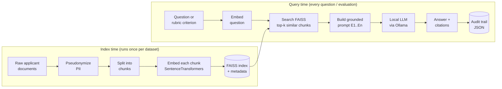
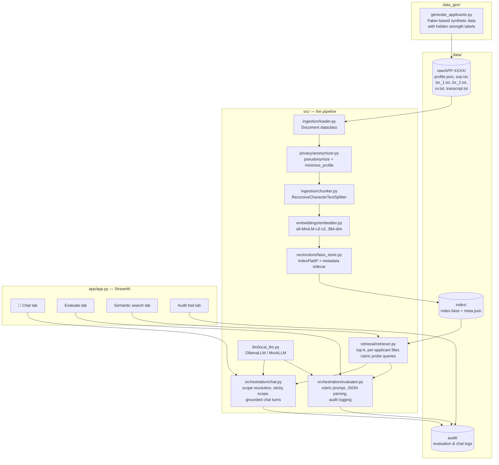
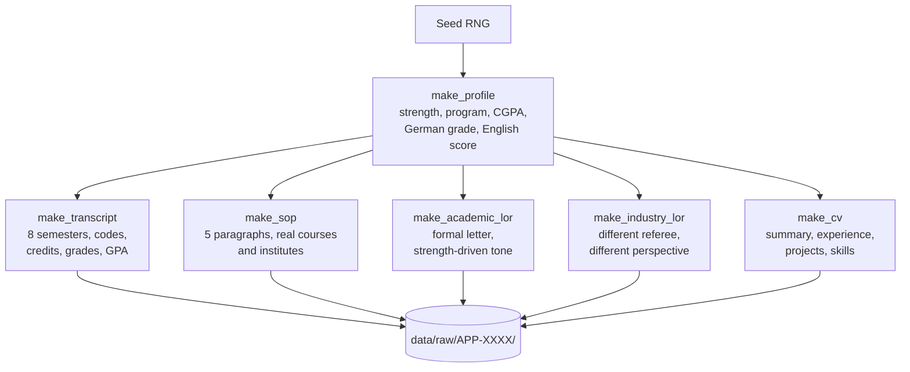
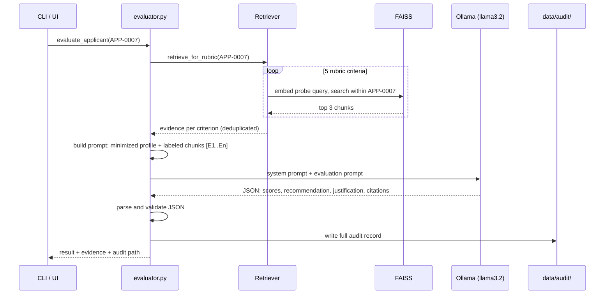
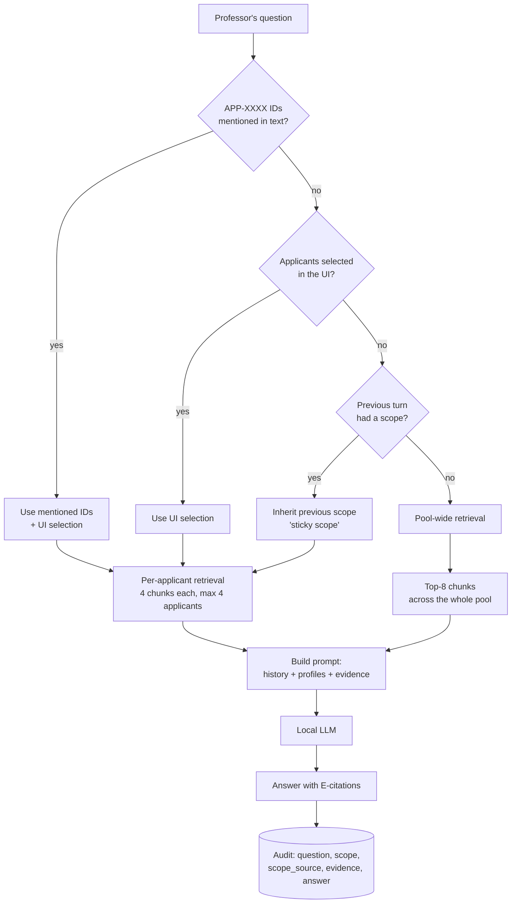

# UniRAG — Complete Technical Documentation

**Leveraging LLMs with RAG for Transparent and Automated University Application Evaluation**

This document explains every component of the system in depth: what it does, why it was designed that way, and how the pieces fit together. Diagrams are written in Mermaid and render automatically on GitHub (in VS Code, install the "Markdown Preview Mermaid Support" extension and press `Ctrl+Shift+V`).

---

## Table of Contents

1. [What This Project Is](#1-what-this-project-is)
2. [The Big Picture: How RAG Works Here](#2-the-big-picture-how-rag-works-here)
3. [System Architecture](#3-system-architecture)
4. [Repository Structure](#4-repository-structure)
5. [Stage 1 — Synthetic Data Generation](#5-stage-1--synthetic-data-generation)
6. [Stage 2 — Ingestion and Loading](#6-stage-2--ingestion-and-loading)
7. [Stage 3 — Privacy: Pseudonymization and Data Minimization](#7-stage-3--privacy-pseudonymization-and-data-minimization)
8. [Stage 4 — Chunking](#8-stage-4--chunking)
9. [Stage 5 — Embeddings](#9-stage-5--embeddings)
10. [Stage 6 — The FAISS Vector Store](#10-stage-6--the-faiss-vector-store)
11. [Stage 7 — Retrieval](#11-stage-7--retrieval)
12. [Stage 8 — The Local LLM Layer](#12-stage-8--the-local-llm-layer)
13. [Stage 9 — The Rubric Evaluator](#13-stage-9--the-rubric-evaluator)
14. [Stage 10 — The Professor Chat Engine](#14-stage-10--the-professor-chat-engine)
15. [The Streamlit User Interface](#15-the-streamlit-user-interface)
16. [The Audit Trail: Transparency by Design](#16-the-audit-trail-transparency-by-design)
17. [GDPR and EU AI Act Mapping](#17-gdpr-and-eu-ai-act-mapping)
18. [Configuration Reference](#18-configuration-reference)
19. [Testing Strategy](#19-testing-strategy)
20. [Command Cheat Sheet](#20-command-cheat-sheet)
21. [Glossary of Concepts](#21-glossary-of-concepts)
22. [Known Limitations and Roadmap](#22-known-limitations-and-roadmap)

---

## 1. What This Project Is

Universities receive thousands of Master's applications. Each contains a Statement of Purpose (SOP), letters of recommendation (LORs), a CV, and a transcript. Reviewing them is slow, and purely manual review makes it hard to guarantee consistency. This project builds an AI assistant that helps a human reviewer by reading all documents of an applicant, retrieving the passages relevant to each evaluation criterion, and producing an evidence-grounded assessment — while never making the final decision itself.

Three constraints shape the entire design. First, applicant documents are highly sensitive personal data, so under **GDPR** the system must minimize, pseudonymize, and locally process everything — no applicant text ever leaves the machine. Second, admissions is a **high-risk AI use case under the EU AI Act**, which demands transparency and human oversight — so every AI output is traceable to the exact evidence and prompt that produced it, and outputs are framed as recommendations for a human. Third, the system must run on ordinary hardware, which motivates the use of **quantized Small Language Models (SLMs)** served locally via Ollama instead of cloud APIs.

The applicant pool is synthetic (generated with Faker) and focused on three real University of Stuttgart programs: **MSc Computer Science**, **MSc Information Technology (INFOTECH)**, and **MSc Electrical Engineering**. Because the data is synthetic, each applicant carries a hidden ground-truth quality label (`_strength`: strong / average / weak) that the documents are written to reflect — which later allows measuring whether the AI's judgments correlate with the planted signal.

---

## 2. The Big Picture: How RAG Works Here

**Retrieval-Augmented Generation (RAG)** solves a fundamental problem: an LLM cannot "know" your private documents, and stuffing all documents into every prompt is impossible (context windows are finite) and wasteful. RAG splits the job in two. At **index time**, documents are cut into chunks, each chunk is converted into an *embedding* (a vector of numbers capturing its meaning), and the vectors are stored in a searchable index. At **query time**, the question is embedded the same way, the index returns the most semantically similar chunks, and only those chunks are placed into the LLM's prompt. The LLM then answers *grounded* in retrieved evidence rather than from its (unreliable, generic) training memory.

The two phases of this project:



Why this matters compared to alternatives: fine-tuning a model on applicant data would bake personal data into model weights (a GDPR nightmare) and require retraining for every new applicant. RAG keeps the data in ordinary files, updatable and deletable at any time — deletion is as simple as removing the applicant's folder and rebuilding the index, which directly supports the GDPR right to erasure.

---

## 3. System Architecture

The full component architecture, including both user-facing paths (rubric evaluation and free-form chat):



The design principle throughout is **separation of concerns**: each module does one thing and exposes a small interface, so any piece can be swapped (a different embedding model, Qdrant instead of FAISS, a bigger LLM) without touching the rest. `config.yaml` is the single source of truth for all tunable parameters — no module hardcodes a path, model name, or threshold.

---

## 4. Repository Structure

```
uni-rag/
├── config.yaml                  # Central configuration (paths, models, parameters)
├── requirements.txt             # Python dependencies
├── CLAUDE.md                    # Project context for Claude Code + roadmap
├── README.md                    # Quickstart
├── .streamlit/config.toml       # Disables file watcher (silences log noise)
├── data_gen/
│   └── generate_applicants.py   # Synthetic applicant generator (v2)
├── data/
│   ├── raw/APP-XXXX/            # Generated documents per applicant
│   ├── index/                   # Persisted FAISS index + metadata
│   └── audit/                   # Evaluation and chat audit records
├── src/
│   ├── ingestion/               # loader.py, chunker.py
│   ├── privacy/                 # anonymizer.py
│   ├── embeddings/              # embedder.py
│   ├── vectorstore/             # faiss_store.py
│   ├── retrieval/               # retriever.py
│   ├── llm/                     # local_llm.py
│   ├── orchestration/           # evaluator.py, chat.py
│   └── pipeline.py              # CLI entry point (build-index, query, evaluate)
├── app/
│   └── app.py                   # Streamlit UI (4 tabs)
└── tests/                       # pytest suite (pipeline + chat, model-free)
```

The naming mirrors the pipeline order: data flows ingestion → privacy → embeddings → vectorstore → retrieval → orchestration, and the folder layout makes that flow visible at a glance.

---

## 5. Stage 1 — Synthetic Data Generation

**File:** `data_gen/generate_applicants.py`

Real applicant data cannot be used for development (privacy, consent, availability), so the project generates realistic synthetic applicants. This is not just placeholder text — the generator is a small domain model of the Stuttgart admissions world, and its realism directly determines how meaningful every downstream experiment is.

### The domain model

The `PROGRAMS` dictionary encodes the three target programs, and for each one: its official specializations (e.g. INFOTECH's Embedded Systems / Communications / Computer Hardware-Software Engineering / Micro- and Optoelectronics), which Bachelor degrees qualify for it, which real Master's courses an applicant would name in an SOP, and which real Stuttgart institutes (IPVS, IAAS, ITI, ISS, IKR, ILEA…) they would reference. INFOTECH applicants get blended CS+EE undergraduate coursework, mirroring the program's real interdisciplinary character.

### The hidden ground-truth label

Every applicant is assigned `_strength ∈ {strong, average, weak}` with weights 3:5:2. This single label then *consistently* drives every artifact:

| Artifact | strong | average | weak |
|---|---|---|---|
| CGPA (10-point) | 8.4–9.6 | 7.2–8.4 | 6.0–7.2 |
| Transcript grades | O, A+, A pool | A+…B pool | A…C pool |
| English score (IELTS) | 7.0–8.5 | 6.5–7.5 | 6.0–7.0 |
| Academic LOR tone | "top 5% … highest, unreserved recommendation" | "solid, dependable … confident recommendation" | "inconsistent … with the reservations noted above" |
| Industry LOR tone | "delivered beyond scope, would rehire immediately" | "grew visibly, minimal supervision by the end" | "needed additional guidance, positive attitude" |

This consistency is the point: a good evaluator should be able to *recover* the hidden label from the documents alone. Because the label is never shown to the LLM, comparing LLM scores against `_strength` gives an objective accuracy measurement — the foundation for the quantitative evaluation chapter of the thesis.

### The German grade conversion

Bachelor grades use an Indian-style 10-point CGPA. German universities convert foreign grades with the **modified Bavarian formula**:

```
german_grade = 1.0 + 3.0 × (N_max − N_d) / (N_max − N_min)
```

where `N_max = 10` (best possible), `N_min = 5` (minimum pass), `N_d` = achieved CGPA. The result is clamped to [1.0, 4.0], where 1.0 is best. A CGPA of 9.22 becomes 1.47 — an excellent German grade. This is the actual formula German admissions offices use, so the profiles carry exactly the number a Stuttgart reviewer would look at.

### Document construction

Each applicant folder contains six files. The **transcript** is built semester by semester (8 semesters over 4 years): each semester samples courses from year-appropriate pools (common first-year → discipline core → advanced electives, plus labs and soft-skill modules), assigns credits and strength-biased letter grades, and computes a semester GPA — closing with total credits, CGPA, classification ("First Class with Distinction" at CGPA ≥ 8.25), and the German equivalent grade. The **SOP** follows a five-paragraph template (academic spark → academic background with thesis → professional experience and extracurriculars → why this program at Stuttgart, naming actual courses and institutes → future goals). The **two LORs** are full formal letters — date, addressee block, subject line, salutation, four to five body paragraphs, signature block with contact details — written from two different perspectives (an academic professor and an industry supervisor) whose wording shifts with the strength label. The **CV** contains a professional summary, dated experience entries with responsibility bullets, projects, a skills matrix, language certificates, and leadership activities. The `aps_required` flag is set for Chinese/Vietnamese/Mongolian applicants, mirroring the real APS certificate requirement for German university admission.

Everything is seeded (`--seed 42` by default), so the dataset is **fully reproducible**: anyone can regenerate byte-identical data, which is why committing the generated files to git is optional.



---

## 6. Stage 2 — Ingestion and Loading

**File:** `src/ingestion/loader.py`

The loader converts raw files into a uniform in-memory representation. The core abstraction is a small dataclass:

```python
@dataclass
class Document:
    applicant_id: str   # "APP-0007"
    doc_type: str       # sop | lor_1 | lor_2 | cv | transcript
    text: str           # full document text
    metadata: dict      # doc label, program, ...
```

`load_applicant()` reads one applicant folder and returns the parsed `profile.json` plus a list of `Document`s; `load_all()` iterates the whole pool. Keeping `doc_type` attached to every document is essential: it survives through chunking into the vector store's metadata, which later lets the UI show "this evidence came from the academic LOR" — provenance is preserved end to end. The design also isolates *format* concerns: when the roadmap item "PDF ingestion" arrives, only this module changes (parse PDF → produce the same `Document` objects), and everything downstream works untouched.

---

## 7. Stage 3 — Privacy: Pseudonymization and Data Minimization

**File:** `src/privacy/anonymizer.py`

This stage runs *before* any text is embedded or shown to an LLM, and it implements two distinct GDPR techniques.

**Pseudonymization (GDPR Art. 4(5))** replaces direct identifiers with the stable applicant ID. `pseudonymize()` takes a document's text and the profile, replaces the full name and each name part with `APP-XXXX`, and regex-redacts email addresses and phone numbers. The crucial architectural property: the mapping *ID → real identity* exists only in `profile.json` on disk — it is never written into the FAISS index, never placed in a prompt, and never appears in an audit log. Under GDPR, pseudonymized data is still personal data, but the separation of the re-identification key from the working data is exactly what Art. 4(5) describes, and it means the entire index, every prompt, and every audit record can be inspected or shared without exposing identities.

**Data minimization (GDPR Art. 5(1)(c))** is implemented by `minimize_profile()`: when a structured profile must accompany a prompt (evaluations and chat both use this), only the fields necessary for the evaluation purpose are kept — program, grades, English score, internships, publications, interests. Name, email, and date of birth are stripped even though the LLM runs locally, because minimization is a principle, not just a transport concern.

For production use, the regex layer would be replaced by an NER-based PII detector (e.g. Microsoft Presidio), but the architectural seam — one function through which all text passes before indexing — stays identical.

---

## 8. Stage 4 — Chunking

**File:** `src/ingestion/chunker.py`

Why chunk at all? Two reasons. Embedding models have small input limits (the MiniLM model truncates around 256 word pieces), so a whole LOR cannot be represented faithfully by one vector. And retrieval precision demands granularity: if the professor asks about "weaknesses mentioned by the referee", the system should return *the paragraph* containing the hedged language, not the entire letter.

The chunker uses LangChain's `RecursiveCharacterTextSplitter` with `chunk_size: 700` characters and `chunk_overlap: 100`. "Recursive" means it tries to split at the most natural boundary first — paragraph breaks (`\n\n`), then line breaks, then sentence ends, then spaces — only degrading to harder cuts when a segment is still too long. This is why retrieved evidence usually reads as a coherent paragraph. The **overlap** ensures that a sentence sitting exactly on a boundary appears in full in at least one chunk, at the cost of some duplication. A plain-Python fallback splitter keeps the module importable even without LangChain installed (useful for tests and minimal environments).

Every chunk gets a globally unique ID of the form `APP-0007:lor_1:2` (applicant : document : position), carried into the vector store metadata. With the v2 long-form documents, each applicant produces roughly 33–37 chunks, giving the current 25-applicant pool ~880 vectors.

**Tuning intuition:** smaller chunks → more precise retrieval but less context per hit; larger chunks → more context but diluted vectors and noisier ranking. 700/100 is a solid default for letter-style prose; the values live in `config.yaml` precisely so experiments can vary them.

---

## 9. Stage 5 — Embeddings

**File:** `src/embeddings/embedder.py`

An **embedding** maps text to a point in a high-dimensional space such that *semantically similar texts land near each other*. "The referee praised the student's research ability" and "strong endorsement of scientific aptitude" share almost no words, yet their vectors are close — this is what makes retrieval *semantic* rather than keyword-based.

The model is `sentence-transformers/all-MiniLM-L6-v2`: a 6-layer distilled transformer producing **384-dimensional** vectors, ~90 MB on disk, fast on CPU, and specifically trained (on over a billion sentence pairs) so that cosine similarity between its outputs reflects meaning similarity. It downloads once from Hugging Face and then runs fully offline — consistent with the local-only design.

One subtle but important line: `normalize_embeddings=True`. Every vector is scaled to length 1. For unit vectors, the **inner (dot) product equals cosine similarity**, which lets the vector store use FAISS's fast inner-product index while the scores remain interpretable as cosine similarity in [−1, 1] (in practice ~0.3–0.8 for related text). The class exposes just `embed(texts)` for batches (index time) and `embed_query(text)` for single queries — swapping to a stronger model like `all-mpnet-base-v2` or a multilingual one is a one-line config change.

---

## 10. Stage 6 — The FAISS Vector Store

**File:** `src/vectorstore/faiss_store.py`

**FAISS** (Facebook AI Similarity Search) is a library for fast nearest-neighbor search over dense vectors. This project uses `IndexFlatIP`: *Flat* means exact brute-force search over all vectors (no approximation), *IP* means inner product as the similarity measure — which, thanks to normalization, is cosine similarity. For 880 vectors, brute force takes microseconds; approximate indexes (IVF, HNSW) only become necessary at hundreds of thousands of vectors, and the class is the seam where that upgrade would happen.

FAISS itself stores *only* vectors — it returns row numbers, not documents. So the store maintains a **metadata sidecar**: a Python list, position-aligned with index rows, holding each chunk's `chunk_id`, `applicant_id`, `doc_type`, and text. `search()` translates FAISS row hits back into meaningful records.

The store also implements **filtered search** — "search only within applicant APP-0007" — using an over-fetch + post-filter strategy: it retrieves `top_k × 10` global results, then keeps only those belonging to the requested applicant, stopping at `top_k`. This is simple and correct for this scale; a production vector database (Qdrant, Weaviate) would filter natively. Persistence is two files, `index.faiss` (binary vectors) and `meta.json` (sidecar), written by `save()` and reloaded by `load()` — so the index is built once and reused across CLI runs and UI sessions.

---

## 11. Stage 7 — Retrieval

**File:** `src/retrieval/retriever.py`

The retriever composes the embedder and the store into the query-time operation: embed the question, search, return ranked chunks. Two usage patterns exist.

**Free-form retrieval** (`retrieve(query, applicant_id=None)`) backs the semantic-search tab and the chat engine: one query, top-k results, optionally filtered to one applicant.

**Rubric-aligned retrieval** (`retrieve_for_rubric(applicant_id)`) backs the evaluator and embodies a key design decision. Instead of one generic query per applicant, the system defines one *probe query* per evaluation criterion:

| Criterion | Probe query (abridged) |
|---|---|
| academic_readiness | grades, GPA, coursework, transcript strength |
| research_potential | research experience, thesis, publications, methodology |
| motivation_fit | motivation, goals, why this program, alignment |
| recommendations | recommender assessment, strengths, weaknesses |
| experience_skills | work experience, technical skills, internships |

Each probe is embedded and searched within the applicant's chunks (3 hits per criterion, deduplicated across criteria). The result is a *structured evidence set*: the evaluator knows not just "here are relevant chunks" but "here is the evidence for research potential specifically". This makes the eventual scores explainable — each criterion's score traces to its own evidence — and it guarantees coverage: a generic query would over-retrieve SOP text (which is self-promotional by nature) and under-retrieve transcript data.

---

## 12. Stage 8 — The Local LLM Layer

**File:** `src/llm/local_llm.py`

All generation runs through one tiny interface: `generate(system, prompt) -> str`. Two implementations exist.

**OllamaLLM** talks to the Ollama server running on the machine. Ollama serves **quantized** models — weights compressed from 16-bit floats to ~4-bit integers, shrinking a model to a quarter of its size and making CPU inference practical, at a small quality cost. The default `llama3.2` is a 3B-parameter model (~2 GB quantized): fast enough for interactive use, capable enough to demonstrate the pipeline, and genuinely private because nothing leaves localhost. Temperature is set to 0.1 — evaluation is a task where reproducibility matters more than creativity, and low temperature keeps outputs near-deterministic. `config.yaml` selects the model; upgrading to `qwen2.5:7b` or any other Ollama model requires no code change.

**MockLLM** returns a fixed, well-formed response. It exists so the *entire* pipeline — retrieval, prompting, parsing, audit logging, UI — can run and be tested on a machine with no model installed. `get_llm()` falls back to it automatically when Ollama is unreachable, printing a warning instead of crashing. This "graceful degradation" pattern is why the project worked end to end before Ollama was ever installed.

---

## 13. Stage 9 — The Rubric Evaluator

**File:** `src/orchestration/evaluator.py`

This is where retrieval meets generation. The evaluation of one applicant proceeds as follows:



The **system prompt** encodes the governance rules: base every claim only on labeled evidence, cite evidence IDs per criterion, admit and score conservatively when evidence is missing, score 1–5 per criterion, output *only* JSON in a fixed schema, and — stated explicitly — support the human reviewer, never decide. Forcing **structured JSON output** is what makes the result machine-processable: the UI can render a bar chart of scores, batch evaluation can compute statistics, and calibration against the hidden strength labels becomes a simple join. Because small models sometimes wrap JSON in prose or markdown fences, `parse_response()` extracts the outermost `{...}` with a regex before parsing, and returns a structured error object rather than crashing if parsing fails.

The prompt itself is assembled by `build_prompt()`: the minimized profile as JSON, then every evidence chunk labeled `[E1]…[En]` with its source document type and the criterion that retrieved it, then the instruction. Labeling evidence is what enables *citation*: when the model writes "strong referee endorsement [E3]", a human can open E3 and verify.

---

## 14. Stage 10 — The Professor Chat Engine

**File:** `src/orchestration/chat.py`

Where the evaluator runs a fixed rubric, the chat engine answers *arbitrary* questions — "does APP-0013 have research experience?", "compare these two", "which needs closer human review?" — while keeping the same grounding discipline. Its interesting logic is **scope resolution**: deciding *which applicants* a question is about.



Three mechanisms deserve explanation because each was motivated by an observed failure:

**Sticky scope.** A follow-up like "which of the two is stronger?" contains no IDs. Without a fallback, retrieval degrades to pool-wide search and the model answers from conversation memory while citing irrelevant chunks — a failure observed in live testing. The fix: each turn's resolved scope is remembered, and a scope-less follow-up inherits it. The audit record stores `scope_source` (`explicit` vs `inherited_from_previous_turn`) so the provenance of scoping itself is traceable.

**Per-applicant retrieval with caps.** For comparisons, evidence is retrieved separately per applicant (4 chunks each, at most 4 applicants). A joint query would let the applicant with more or wordier documents dominate the limited context of a 3B model; per-applicant retrieval guarantees balanced representation.

**Anti-contamination rule.** Live testing showed the model attributing one applicant's capstone title to another — details leaking across conversation turns. The system prompt now states that history exists only to understand the question, and every factual claim must come from the *current* evidence and profiles. Small models follow this imperfectly, which is itself a documented finding; the audit trail is what makes such leaks detectable.

Conversation history (last 6 turns) is rendered as plain "Professor: … / Assistant: …" text into the prompt, giving continuity without unbounded context growth.

---

## 15. The Streamlit User Interface

**File:** `app/app.py`

Streamlit turns Python scripts into web apps: the script re-runs top to bottom on each interaction, with `st.session_state` carrying data (like chat history) across re-runs and `@st.cache_resource` ensuring expensive objects — the embedding model, the FAISS index, the LLM client — load exactly once per server, not once per click.

The app presents four tabs. **💬 Chat** is the conversational interface: a message stream with per-answer evidence expanders, a chat input, and a right-hand panel with the applicant multiselect, compact profile cards (CGPA, German grade, English score, internships, publications), and a clear-conversation button that also resets the sticky scope. **Evaluate** shows one applicant's key metrics and runs the rubric evaluation, rendering the recommendation, a score bar chart, the justification, and the full evidence list. **Semantic search** exposes raw retrieval — invaluable for debugging what the index "thinks" is relevant before any LLM touches it. **Audit trail** lists every logged evaluation and chat turn as expandable JSON, making the transparency mechanism itself visible in the product.

A permanent caption on every page states that outputs are AI-assisted recommendations requiring human review — the human-oversight message is part of the interface, not just the documentation.

---

## 16. The Audit Trail: Transparency by Design

**Directory:** `data/audit/`

Every LLM interaction — rubric evaluations and chat turns alike — writes a JSON record containing: a timestamp and the exact model identifier; the full system prompt and user prompt as sent; every evidence chunk with its ID, source document, and similarity score; the raw model output; the parsed result; for chat, the question, resolved scope, and how the scope was determined; and a standing disclaimer that final decisions require human review.

This single mechanism answers the questions a regulator, an appeals process, or a skeptical committee member would ask: *What information did the AI see? What exactly was it asked? What did it answer, verbatim? Can each claim be traced to a source?* Because all text in the trail is pseudonymized, the records can be retained, inspected, and even published without exposing applicant identities. In live testing, the audit trail is also what made model failures diagnosable — it revealed that a mis-scoped follow-up had retrieved chunks from unrelated applicants, turning a vague "the answer seems off" into a precise, fixable bug.

---

## 17. GDPR and EU AI Act Mapping

| Requirement | Where implemented |
|---|---|
| GDPR Art. 4(5) — Pseudonymization | `anonymizer.pseudonymize()`: names/emails/phones replaced by applicant ID before indexing; identity mapping kept only in `profile.json` |
| GDPR Art. 5(1)(c) — Data minimization | `anonymizer.minimize_profile()`: only evaluation-relevant fields reach any prompt |
| GDPR Art. 17 — Right to erasure | Delete the applicant's folder, rebuild the index; no data baked into model weights (a key advantage of RAG over fine-tuning) |
| GDPR — No third-country transfer | Embeddings and LLM inference run entirely on-device (SentenceTransformers + Ollama); no cloud API receives applicant data |
| AI Act — Transparency for high-risk systems | Full audit trail per interaction: prompt, model, evidence, output, scope provenance |
| AI Act — Human oversight | Outputs framed as recommendations; system prompts forbid final decisions; UI disclaimer on every page |
| AI Act — Traceability of claims | Evidence labeling `[E1..En]` with inline citations; every cited chunk inspectable in UI and audit |

An honest caveat for the thesis: synthetic data means no *actual* personal data is processed today; the architecture demonstrates how the obligations would be met with real data, which is precisely the claim to make.

---

## 18. Configuration Reference

**File:** `config.yaml`

| Key | Default | Meaning |
|---|---|---|
| `data.raw_dir` | data/raw | Applicant source documents |
| `data.processed_dir` | data/processed | Reserved for intermediate artifacts |
| `data.index_dir` | data/index | Persisted FAISS index + metadata |
| `data.audit_dir` | data/audit | Evaluation and chat audit records |
| `chunking.chunk_size` | 700 | Max characters per chunk |
| `chunking.chunk_overlap` | 100 | Characters shared between adjacent chunks |
| `embeddings.model_name` | all-MiniLM-L6-v2 | SentenceTransformers model (384-dim) |
| `embeddings.batch_size` | 32 | Chunks embedded per batch |
| `retrieval.top_k` | 6 | Chunks returned per free-form query |
| `llm.provider` | ollama | `ollama` or `mock` |
| `llm.model` | llama3.2 | Any locally pulled Ollama model |
| `llm.temperature` | 0.1 | Low = near-deterministic, right for evaluation |
| `llm.max_tokens` | 900 | Response length cap |
| `privacy.pseudonymize` | true | PII scrubbing before indexing (keep on) |

Changing any value requires no code edits; index-affecting changes (chunking, embedding model) require re-running `build-index`.

---

## 19. Testing Strategy

**Directory:** `tests/` — run with `python -m pytest tests -q`

The suite (9 tests) deliberately covers everything *except* the models, so it runs in well under a second and needs no downloads. `test_pipeline.py` verifies loading (all five document types found), chunking (size bounds respected, IDs attached), pseudonymization (name and email provably absent from output — a privacy regression test), and profile minimization (sensitive fields stripped, evaluation fields kept). `test_chat.py` verifies scope resolution from question text and UI selection, the per-applicant evidence cap, sticky-scope inheritance for follow-ups (a regression test written directly from an observed live failure), audit-record structure including `scope_source`, and prompt assembly. Model behavior itself is assessed not by unit tests but by the calibration methodology: comparing LLM scores against the hidden `_strength` labels.

---

## 20. Command Cheat Sheet

```bash
# One-time / after changing data or chunking or embedding config
python data_gen/generate_applicants.py --n 25        # regenerate synthetic pool
python -m src.pipeline build-index                   # embed + index everything

# Exploration
python -m src.pipeline query --q "embedded systems research"           # pool-wide
python -m src.pipeline query --q "weaknesses" --applicant APP-0008     # scoped

# Evaluation
python -m src.pipeline evaluate --applicant APP-0002                   # rubric run

# UI and tests
streamlit run app/app.py                             # full interface at localhost:8501
python -m pytest tests -q                            # 9 tests, no models needed

# Ollama model management
ollama pull llama3.2            # default 3B model
ollama pull qwen2.5:7b          # stronger alternative (then edit config.yaml)
ollama list                     # show installed models
```

---

## 21. Glossary of Concepts

**RAG (Retrieval-Augmented Generation)** — architecture where an LLM answers using documents retrieved at query time rather than from training memory; keeps data external, current, and deletable. **Embedding** — a vector representation of text where geometric closeness encodes semantic similarity. **Cosine similarity** — similarity of two vectors by the angle between them; equals the dot product for normalized vectors. **Chunk** — a retrieval-sized slice of a document, here ~700 characters split at natural boundaries. **FAISS** — Facebook's similarity-search library; `IndexFlatIP` performs exact inner-product search. **Vector store** — the index plus metadata that maps vectors back to real content. **Top-k** — the k most similar chunks returned per query. **SLM (Small Language Model)** — a model small enough (1–8B parameters) for local deployment. **Quantization** — compressing model weights to fewer bits (e.g. 4-bit) to shrink memory and speed up CPU inference at slight quality cost. **Ollama** — a local server that downloads, quantizes, and serves open LLMs behind a simple API. **Temperature** — sampling randomness; 0.1 here for reproducible evaluations. **System prompt** — standing instructions that define the model's role and rules, separate from the user's content. **Grounding** — constraining the model to answer only from supplied evidence. **Hallucination** — fluent but unsupported model output; the failure mode grounding and audit are designed to catch. **Pseudonymization** — replacing identifiers with a key-controlled alias (GDPR Art. 4(5)); reversible only via a separately held mapping. **Data minimization** — processing only fields necessary for the purpose. **Audit trail** — the per-interaction record of prompt, evidence, model, and output that makes each answer reconstructible. **Rubric** — the fixed set of five evaluation criteria scored 1–5. **Bavarian formula** — Germany's standard conversion of foreign grades to the 1.0–4.0 scale. **Sticky scope** — this project's mechanism for follow-up questions to inherit the previous turn's applicant set.

---

## 22. Known Limitations and Roadmap

Current, honestly stated limitations: the 3B model occasionally blends conversation history into answers (observed and mitigated, not eliminated); dense-only retrieval favors semantically generic passages such as letter headers and can miss exact-term matches (module codes, tool names); scores are not yet validated at scale against the hidden labels; ingestion is plain-text only; and the metadata sidecar loads fully into memory, which is fine at this scale but not at 10,000 applicants.

Each limitation maps to a roadmap item (tracked in `CLAUDE.md`): **hybrid retrieval** (BM25 lexical search fused with dense search via reciprocal rank fusion) targets the header problem and exact-term recall; a **cross-encoder reranker** re-scores the candidate set with a more accurate model; **batch evaluation + calibration** produces the quantitative accuracy numbers against `_strength`; an **agentic evaluator** decomposes evaluation into plan → retrieve per criterion → score → verify-citations steps; an **MCP server** exposes `retrieve` and `evaluate` as tools any MCP-capable client can call; **alternative vector databases** (Qdrant/Chroma) behind the same store interface enable recall/latency comparisons; and **PDF ingestion** connects the system to real-world document formats.

---

*Document version: 1.0 · Covers the state of the project after the professor-chat feature and its fixes (branch `feature/improvements`, merged to `main`).*
